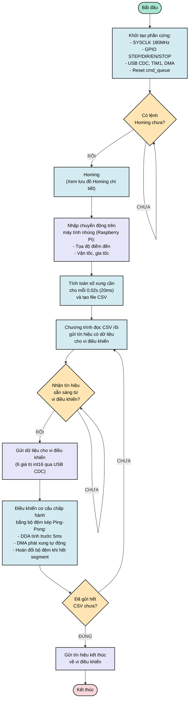
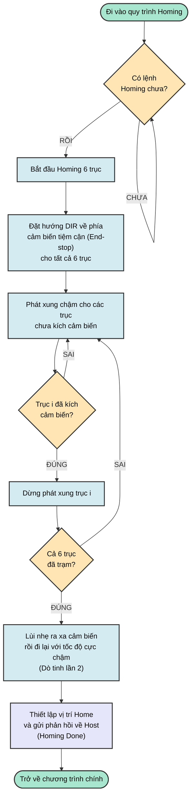
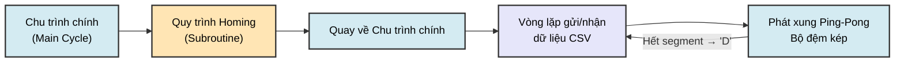

# 07 — Lưu đồ Chu trình Hoạt động Hệ thống & Quy trình Homing

Tài liệu này mô tả **chu trình hoạt động toàn hệ thống** của bộ điều khiển động cơ bước 6 trục — từ khi cấp nguồn, quy trình thiết lập gốc tọa độ (Homing), đến vòng lặp nhận và phát lệnh chuyển động liên tục. Hai lưu đồ chính được trình bày:

1. **Lưu đồ chu trình chính** — Luồng hoạt động tổng thể từ đầu đến cuối.
2. **Lưu đồ quy trình Homing** — Chi tiết việc tìm gốc tọa độ cho 6 trục.

---

## 1. Lưu đồ Chu trình Chính (Main System Cycle)

### 1.1. Tổng quan

Chu trình chính mô tả toàn bộ luồng xử lý từ lúc hệ thống được cấp nguồn cho đến khi hoàn thành phát chuyển động. Luồng xử lý chia thành hai phía:

- **Phía Host (Raspberry Pi):** Nhập quỹ đạo chuyển động, tính toán số xung cần thiết cho mỗi chu kỳ 20ms, tạo file CSV, đọc CSV và gửi dữ liệu từng segment xuống vi điều khiển.
- **Phía Firmware (STM32):** Khởi tạo phần cứng, thực hiện Homing, nhận dữ liệu từ Host, và điều khiển cơ cấu chấp hành bằng bộ đệm kép Ping-Pong.

### 1.2. Lưu đồ giải thuật

### 1.3. Giải thích từng bước

| Bước | Tên | Mô tả chi tiết |
|------|-----|-----------------|
| **1** | Khởi tạo phần cứng | Cấu hình System Clock 180MHz (HSE 12MHz × PLL), khởi tạo GPIO cho 6 trục (STEP, DIR, EN, STOP), USB OTG FS CDC, Timer 1 @ 200kHz, DMA2 Stream 1/2/5, reset hàng đợi lệnh `cmd_queue`. |
| **2** | Chờ lệnh Homing | Hệ thống ở trạng thái IDLE, lắng nghe lệnh `'H'` từ Host qua USB CDC. Không thực hiện bất kỳ chuyển động nào cho đến khi nhận được lệnh Homing. |
| **3** | Thực hiện Homing | Gọi quy trình Homing để thiết lập gốc tọa độ vật lý cho 6 trục bằng cảm biến hành trình (End-stops). Chi tiết xem **Mục 2**. |
| **4** | Nhập chuyển động | Trên Raspberry Pi, người vận hành nhập quỹ đạo chuyển động mong muốn: tọa độ các điểm đến, vận tốc tối đa, gia tốc/giảm tốc. |
| **5** | Tính toán & tạo CSV | Phần mềm trên Raspberry Pi thực hiện phép nội suy quỹ đạo (trajectory interpolation), tính số bước xung cần phát cho mỗi trục trong mỗi chu kỳ 20ms, và xuất ra file CSV. Mỗi dòng CSV chứa 6 giá trị `int16` tương ứng 6 trục. |
| **6** | Đọc CSV & gửi tín hiệu | Chương trình Python trên Raspberry Pi đọc file CSV, mở cổng USB CDC và chuẩn bị gửi từng dòng dữ liệu xuống STM32. |
| **7** | Chờ tín hiệu sẵn sàng | Host chờ STM32 gửi tín hiệu sẵn sàng (ACK `'K'`), xác nhận hàng đợi lệnh `cmd_queue` còn chỗ trống. Nếu nhận NACK `'N'`, Host sẽ chờ và thử lại. |
| **8** | Gửi dữ liệu | Host đóng gói 6 giá trị `int16` thành gói tin 15 bytes (`SOF + 'M' + 12 bytes data + EOL`) và truyền qua USB CDC. |
| **9** | Điều khiển bộ đệm kép | STM32 nhận lệnh, đẩy vào `cmd_queue`. Bộ máy DDA chia 20ms thành 4 phân đoạn 5ms, tính trước trạng thái GPIO lưu vào bộ đệm rảnh. DMA + Timer 1 tự động phát xung ra động cơ từ bộ đệm hoạt động. Khi phát hết 1 phân đoạn, ngắt DMA hoán đổi bộ đệm (Ping ↔ Pong). |
| **10** | Kiểm tra hết CSV | Sau khi phát xong 1 segment 20ms, STM32 gửi `'D'` (Done) về Host. Host kiểm tra còn dòng CSV nào chưa gửi. Nếu còn → quay lại bước 6. Nếu hết → gửi tín hiệu kết thúc. |

---

## 2. Lưu đồ Quy trình Homing (Homing Sequence)

### 2.1. Tổng quan

Quy trình Homing có nhiệm vụ tìm **gốc tọa độ vật lý** ($0$) cho cả 6 trục bằng cách di chuyển các trục về phía cảm biến hành trình (End-stop / Proximity Sensor). Quy trình được thiết kế để:

- Xử lý **độc lập từng trục**: Trục nào chạm cảm biến trước sẽ dừng trước, các trục khác tiếp tục.
- Đảm bảo **độ chính xác cao**: Sử dụng kỹ thuật dò 2 lần (dò thô + dò tinh) để loại bỏ sai số cơ học do quán tính.

### 2.2. Lưu đồ giải thuật

### 2.3. Giải thích từng bước

| Bước | Tên | Mô tả chi tiết |
|------|-----|-----------------|
| **1** | Nhận lệnh Homing | STM32 nhận ký tự `'H'` từ Raspberry Pi qua USB CDC, chuyển sang trạng thái Homing. |
| **2** | Bắt đầu Homing | Kích hoạt quy trình Homing cho tất cả 6 trục đồng thời. Đặt cờ `homing_active = 1`. |
| **3** | Đặt hướng DIR | Thiết lập chân `DIR` của 6 trục quay ngược về hướng lắp cảm biến hành trình (End-stops). Mỗi trục có thể có hướng cảm biến khác nhau tùy cấu hình cơ khí. |
| **4** | Phát xung chậm (Dò thô) | Phát chuỗi xung với tốc độ trung bình cho **tất cả các trục chưa chạm** cảm biến. Tốc độ dò thô đủ nhanh để tiết kiệm thời gian nhưng đủ chậm để cảm biến phản hồi kịp. |
| **5** | Kiểm tra kích cảm biến | Bộ xử lý liên tục đọc trạng thái các chân `STOP_0` đến `STOP_5`. Khi chân `STOP_i` chuyển sang trạng thái tích cực → trục `i` đã chạm cảm biến. |
| **6** | Dừng trục đã chạm | Trục vừa chạm cảm biến sẽ bị dừng phát xung ngay lập tức. Các trục khác vẫn tiếp tục di chuyển. |
| **7** | Kiểm tra toàn bộ | Kiểm tra xem cả 6 trục đã chạm cảm biến chưa. Nếu chưa đủ → quay lại bước 4 tiếp tục phát xung cho các trục còn lại. |
| **8** | Lùi lò xo & Dò tinh | Sau khi cả 6 trục đều chạm lần 1, hệ thống điều khiển tất cả trục **lùi nhẹ** ra xa cảm biến (khoảng 100-200 bước) để nhả công tắc hành trình. Sau đó tiến lại với **tốc độ cực chậm** (≈ 1/10 tốc độ dò thô) để chạm cảm biến lần 2. Kỹ thuật này loại bỏ sai số do quán tính cơ học, nâng độ chính xác lặp lại lên mức ±1 bước. |
| **9** | Thiết lập gốc tọa độ | Reset thanh ghi bộ đếm vị trí thực tế của 6 trục về $0$. Xóa hàng đợi lệnh `cmd_queue`. Gửi phản hồi `"Homing Done"` về Host để báo sẵn sàng nhận lệnh chuyển động. |

---

## 3. Mối liên hệ giữa hai Lưu đồ

**Luồng tổng thể:**

1. Hệ thống khởi động → Khởi tạo phần cứng.
2. Chờ và thực hiện **Homing** (lưu đồ con).
3. Sau khi Homing xong → Host bắt đầu **vòng lặp gửi CSV**.
4. Mỗi dòng CSV được gửi xuống STM32 → STM32 phát xung bằng **bộ đệm kép Ping-Pong**.
5. Khi phát xong segment → STM32 gửi `'D'` → Host gửi dòng tiếp theo.
6. Khi hết CSV → Host gửi tín hiệu kết thúc → Hệ thống về IDLE.

---

## 4. Giao thức Flow Control tương ứng

Dưới đây là bảng ánh xạ giữa các bước trong lưu đồ và tín hiệu giao tiếp USB:

| Pha trong Lưu đồ | Hướng truyền | Tín hiệu | Ý nghĩa |
|---|---|---|---|
| Chờ lệnh Homing | Host → STM32 | `'H'` | Kích hoạt quy trình Homing |
| Homing hoàn thành | STM32 → Host | `"Homing Done"` | Sẵn sàng nhận lệnh chuyển động |
| Gửi dữ liệu di chuyển | Host → STM32 | `SOF + 'M' + data + EOL` | Gói lệnh di chuyển 20ms (15 bytes) |
| Nhận thành công | STM32 → Host | `'K'` (ACK) | Hàng đợi đã xếp lệnh thành công |
| Hàng đợi đầy | STM32 → Host | `'N'` (NACK) | Host cần chờ và thử lại |
| Phát xong segment | STM32 → Host | `'D'` (Done) | Đã phát xong 20ms, sẵn sàng nhận tiếp |
| Dừng khẩn cấp | Host → STM32 | `'E'` | Tắt Timer, DMA, dừng tất cả động cơ |

---

## 5. Tham chiếu Mã nguồn

| Module | File | Vai trò |
|--------|------|---------|
| Khởi tạo hệ thống | [main.c](../Core/Src/main.c) | Cấu hình clock, GPIO, gọi vòng lặp chính |
| Bộ đệm kép Ping-Pong | [main_pingpong.c](../Core/Src/main_pingpong.c) | DDA engine, pre-compute, swap buffer |
| Ngắt DMA & hoán đổi | [stm32f4xx_it.c](../Core/Src/stm32f4xx_it.c) | DMA Transfer Complete ISR |
| Giao tiếp USB CDC | [usbd_cdc_if.c](../USB_DEVICE/App/usbd_cdc_if.c) | Nhận/gửi lệnh qua USB |
| Cấu hình USB OTG | [usb_otg.c](../Core/Src/usb_otg.c) | Khởi tạo ngoại vi USB OTG FS |
| Định nghĩa GPIO & struct | [main.h](../Core/Inc/main.h) | Pin mapping, cấu trúc dữ liệu |

---

## 6. Tài liệu liên quan

- [Kiến trúc hệ thống](system_architecture.md) — Sơ đồ khối, cơ chế bộ đệm kép, GPIO mapping
- [Thuật toán DDA](03_dda_algorithm.md) — Chi tiết thuật toán Digital Differential Analyzer
- [Thuật toán Ping-Pong](ping_pong.md) — Lưu đồ chi tiết cơ chế bộ đệm kép
- [Giao tiếp USB](04_usb_communication.md) — Giao thức truyền nhận lệnh USB CDC
- [Lưu đồ hệ thống (Mermaid)](system_flowchart.md) — Lưu đồ trạng thái dạng Mermaid diagram
