# Báo cáo Thuật toán Đệm Kép Ping-Pong (Double-Buffering Ping-Pong)

Tài liệu này trình bày chi tiết về kiến trúc, nguyên lý hoạt động, lưu đồ giải thuật và các ưu điểm vượt trội của cơ chế bộ đệm kép (Double-Buffering Ping-Pong) kết hợp DMA được triển khai trên vi điều khiển STM32F446ZE để điều khiển đồng bộ 6 trục động cơ bước.

---

## 1. Tổng quan & Lý do Thiết kế (Overview)

Trong các hệ thống CNC hoặc cánh tay robot nhiều trục, thuật toán **DDA (Digital Differential Analyzer)** được sử dụng để điều khiển các trục di chuyển đồng thời và đến đích cùng một lúc. 

Thông thường, thuật toán DDA yêu cầu CPU phải tính toán bộ tích lũy và lật trạng thái chân GPIO trong ngắt định thời (Timer ISR) với tần số rất cao (200kHz). Tuy nhiên, cách tiếp cận truyền thống này gặp phải hai giới hạn nghiêm trọng:
1. **Quá tải CPU:** Việc thực hiện các phép tính cộng, so sánh và cập nhật GPIO cho 6 trục liên tục mỗi 5µs sẽ chiếm dụng tới 60-80% hiệu năng của CPU.
2. **Nghẽn truyền thông:** Khi Raspberry Pi gửi dữ liệu tọa độ qua USB CDC, ngắt USB sẽ xung đột với ngắt DDA, gây ra hiện tượng mất gói tin USB hoặc méo xung động cơ (Jitter).

> [!NOTE]
> **Giải pháp:** Cơ chế bộ đệm kép Ping-Pong chuyển toàn bộ việc tính toán DDA về xử lý nền (Main Loop) dưới dạng tính trước (Pre-computation), và giao việc phát xung thời gian thực hoàn toàn cho phần cứng (DMA + Timer) tự động thực hiện.

---

## 2. Nguyên lý Hoạt động (Working Principle)

Lệnh di chuyển tiêu chuẩn được gửi từ Raspberry Pi có thời gian chạy là **20 ms** (tương đương 4000 ticks DDA). Do giới hạn RAM của chip STM32F446ZE (128 KB), hệ thống chia nhỏ lệnh 20 ms này thành **4 phân đoạn nhỏ, mỗi phân đoạn dài 5 ms** (1000 ticks DDA).

Hệ thống duy trì hai bộ đệm trong RAM đại diện cho hai trạng thái **Ping** (Buffer 0) và **Pong** (Buffer 1):

* **Pha tính toán (CPU):** CPU chạy ngầm ở vòng lặp chính (`while(1)`), đọc lệnh từ hàng đợi và tính toán trước trạng thái các chân GPIO (dưới dạng giá trị nạp thanh ghi `BSRR` của Port F, G, C) cho 5 ms tiếp theo, sau đó điền vào bộ đệm đang rảnh (ví dụ Buffer 1).
* **Pha phát xung (DMA + Timer):** Cùng lúc đó, bộ điều khiển DMA tự động đọc dữ liệu từ bộ đệm đang hoạt động (ví dụ Buffer 0) đẩy ra thanh ghi `BSRR` để phát xung ra động cơ, được kích hoạt bởi nhịp đập 2.5µs từ Timer 1.
* **Pha tráo đổi (Interrupt Swap):** Khi DMA phát hết 5 ms dữ liệu của Buffer 0, ngắt DMA Transfer Complete xảy ra. CPU lập tức tráo địa chỉ phát sang Buffer 1 để động cơ tiếp tục quay mượt mà, đồng thời đánh dấu Buffer 0 trống để chuẩn bị tính toán cho phân đoạn tiếp theo.

---

## 3. Lưu đồ Giải thuật (Flowchart Diagram)

Dưới đây là lưu đồ thể hiện sự phối hợp nhịp nhàng giữa **Vòng lặp chính (CPU)**, **Giao tiếp USB**, và **Ngắt DMA (Phần cứng)**:

```mermaid
graph TD
    %% Định nghĩa các Style
    classDef cpu fill:#d4ebf2,stroke:#333,stroke-width:2px;
    classDef dma fill:#ffe5b4,stroke:#333,stroke-width:2px;
    classDef usb fill:#e6e6fa,stroke:#333,stroke-width:2px;

    subgraph "VÒNG LẶP CHÍNH (CPU - Main Loop)"
        A[Start main_pingpong] --> B{Hàng đợi trống <br/> & Không chạy?}
        B -- Yes --> C[Chờ lệnh di chuyển tiếp theo]
        B -- No --> D[Lấy lệnh di chuyển 20ms từ Queue]
        D --> E[Đặt current_move_ticks_left = 4000]
        E --> F{Có bộ đệm nào rảnh <br/> pp_buf_ready == 0?}
        F -- Yes --> G[DDA_PreCompute_PP_Chunk <br/> Tính trước 5ms lưu vào RAM]
        G --> H[Đánh dấu pp_buf_ready = 1]
        H --> I[Trừ current_move_ticks_left đi 1000]
        I --> J{DMA đang chạy?}
        J -- No --> K[DDA_Start_PP <br/> Bật Timer & DMA phát bộ đệm hiện tại]
        J -- Yes --> F
        F -- No --> J
    end

    subgraph "NGẮT GIAO TIẾP USB (USB ISR)"
        U1[Nhận lệnh 'M' từ Host] --> U2{Hàng đợi còn chỗ?}
        U2 -- Yes --> U3[Đẩy vào cmd_queue]
        U3 --> U4[Gửi ACK 'K' về Host]
        U2 -- No --> U5[Gửi NACK 'N' về Host]
    end

    subgraph "NGẮT HOÀN THÀNH DMA (DMA ISR)"
        D1[DMA phát xong 5ms - Ngắt TCIF] --> D2[Đánh dấu bộ đệm vừa phát xong = Trống]
        D2 --> D3{Đã phát đủ 20ms <br/> current_play_ticks_left == 0?}
        D3 -- Yes --> D4[Gửi tín hiệu 'D' Done về Host]
        D3 -- No --> D5[Giảm current_play_ticks_left đi 1000]
        D4 --> D6[Hoán đổi chỉ số bộ đệm <br/> pp_current_buf = 1 - pp_current_buf]
        D5 --> D6
        D6 --> D7{Bộ đệm tiếp theo đã sẵn sàng <br/> pp_buf_ready == 1?}
        D7 -- Yes --> D8[DDA_Start_PP <br/> DMA phát bộ đệm tiếp theo]
        D7 -- No --> D9[Dừng Timer & DMA <br/> simulation_running = 0]
    end

    %% Áp dụng Class
    class A,B,C,D,E,F,G,H,I,J,K cpu;
    class U1,U2,U3,U4,U5 usb;
    class D1,D2,D3,D4,D5,D6,D7,D8,D9 dma;
```

---

## 4. Các Ưu điểm Vượt trội (Key Advantages)

### 💾 4.1. Tối ưu hóa bộ nhớ SRAM (SRAM Optimization)
* **Thách thức:** Mỗi xung nhịp DDA yêu cầu lưu trữ trạng thái của 3 cổng GPIO (Port F, G, C). Nếu lưu trữ toàn bộ dạng xung của một lệnh di chuyển 20ms (4000 ticks) vào mảng đệm kép, dung lượng RAM cần dùng là:
  $$\text{RAM} = 4000 \times 2 \ (\text{transfers/tick}) \times 4 \ (\text{bytes/BSRR}) \times 3 \ (\text{ports}) \times 2 \ (\text{buffers}) = 192\text{ KB}$$
  Mức này vượt quá tổng dung lượng SRAM của chip STM32F446ZE ($128\text{ KB}$), gây sập hệ thống ngay lập tức.
* **Giải pháp Ping-Pong:** Bằng cách chia nhỏ thành các phân đoạn 5ms (1000 ticks), dung lượng RAM yêu cầu giảm xuống chỉ còn:
  $$\text{RAM} = 1000 \times 2 \times 4 \times 3 \times 2 = 48\text{ KB}$$
  Chỉ chiếm khoảng **37.5% SRAM**, đảm bảo an toàn tuyệt đối cho vùng nhớ Stack và Heap của vi điều khiển.

### ⚡ 4.2. Giải phóng năng lực xử lý của CPU (CPU Offloading)
* **Trước tối ưu:** CPU phải nhảy vào ngắt mỗi 5µs để chạy thuật toán DDA và đổi trạng thái chân GPIO cho 6 trục, chiếm tới 60-80% thời gian xử lý thực tế của CPU.
* **Sau tối ưu:** DMA tự động chuyển dữ liệu từ RAM ra GPIO bằng phần cứng. CPU được giải phóng hoàn toàn trong quá trình phát xung (CPU Load = 0%). CPU chỉ hoạt động trong một khoảnh khắc cực ngắn khi nhận ngắt DMA Transfer Complete để tráo đổi bộ đệm.

### ⏱️ 4.3. Không méo dạng xung (Zero Jitter / Precise Timing)
* Vì việc truyền dữ liệu từ bộ đệm RAM vào thanh ghi `BSRR` được điều khiển hoàn toàn bằng phần cứng (sự kiện Timer kích hoạt DMA), thời gian phát xung đạt độ chính xác ở mức nano giây. 
* Hệ thống loại bỏ hoàn toàn hiện tượng trễ ngắt do CPU bận xử lý tác vụ khác (Interrupt Latency), giúp xung STEP luôn đều đặn, triệt tiêu hiện tượng giật cục, rung lắc cơ học và mất bước của động cơ.

### 📡 4.4. Truyền thông không chặn (Non-blocking Communication)
* Ngắt USB CDC (`OTG_FS_IRQHandler`) và các ngắt ngoại vi khác (như SDIO, CAN) có thể kích hoạt bất kỳ lúc nào để nhận lệnh mới mà không sợ làm gián đoạn hay méo xung phát ra động cơ.
* Cơ chế này cho phép thiết lập hệ thống stream quỹ đạo liên tục từ máy tính chủ xuống mạch điều khiển mà không có độ trễ giữa các lệnh di chuyển.

---

## 5. Tham chiếu mã nguồn ứng dụng

* Khởi tạo và cấu hình dữ liệu bộ đệm kép: [main.h](file:///d:/final/Core/Inc/main.h)
* Thuật toán nạp và tính toán trước phân đoạn DDA: [main_pingpong.c](file:///d:/final/Core/Src/main_pingpong.c)
* Hàm xử lý ngắt tráo đổi bộ đệm kép: [stm32f4xx_it.c](file:///d:/final/Core/Src/stm32f4xx_it.c#L163-L210)
