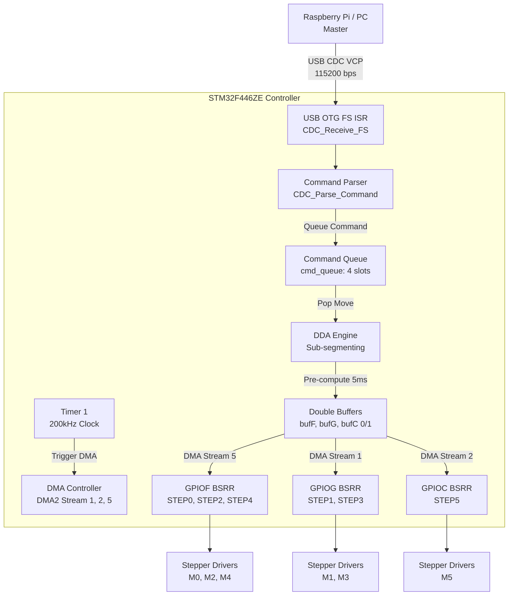

# Cấu trúc Kiến trúc Hệ thống (System Architecture)

Tài liệu này mô tả chi tiết kiến trúc phần mềm và phần cứng của bộ điều khiển động cơ bước 6 trục đồng bộ sử dụng vi điều khiển **STM32F446ZETx**, tập trung vào cơ chế bộ đệm kép (Double-Buffering Ping-Pong), giao tiếp thời gian thực qua USB CDC và đồng bộ hóa DMA-Timer.

---

## 1. Sơ đồ khối tổng thể (Block Diagram)

Hệ thống được thiết kế theo mô hình **Master-Slave** thời gian thực giữa máy tính điều khiển (Raspberry Pi/PC/Host) và mạch STM32:



### Luồng xử lý chi tiết:
1. **Host PC / Raspberry Pi** truyền lệnh di chuyển 20 ms dưới dạng mảng xung (ví dụ: `[1800, 2000, 3000, 2000, 500, 0]`) qua cổng USB CDC VCP.
2. **USB CDC Interrupt** tiếp nhận gói tin thô, kích hoạt ngắt giao tiếp và chuyển tới Parser để giải mã lệnh.
3. Lệnh giải mã thành công được đẩy vào hàng đợi chuyển động (`cmd_queue`).
4. Bộ máy DDA phân chia nhỏ lệnh 20 ms thành **bốn phân đoạn 5 ms** (1000 ticks) để tiết kiệm RAM.
5. CPU tính toán trước trạng thái chân GPIO lưu vào bộ đệm phụ (Buffer B) trong khi DMA đang tự động phát bộ đệm chính (Buffer A) ra các cổng ngoại vi.
6. Mỗi nhịp đếm của **Timer 1 (200kHz)** sẽ trực tiếp kích hoạt DMA truyền dữ liệu ghi đè lên các thanh ghi GPIO BSRR (cổng F, G, C) mà không cần can thiệp của CPU.
7. Khi phát hết 1 phân đoạn 5 ms, ngắt DMA Transfer Complete hoán đổi tức thì địa chỉ đệm (swap buffer) với độ trễ 0 ms.
8. Khi hoàn thành toàn bộ 4 phân đoạn (đủ 20 ms), ngắt báo cho ứng dụng để gửi tín hiệu `'D'` (Done) về PC nhằm nạp phân đoạn tiếp theo.

---

## 2. Cơ chế Bộ đệm kép Ping-Pong & Kiểm soát luồng (Flow Control)

### Ràng buộc bộ nhớ (SRAM Constraint)
* **Vi điều khiển STM32F446ZE** chỉ có **128 KB SRAM**.
* Một lệnh di chuyển đầy đủ kéo dài **20 ms (4000 ticks DDA)**.
* Nếu lưu trữ cả 3 cổng GPIO (F, G, C) cho 4000 ticks DDA ở dạng bộ đệm kép, ta cần: 
  $$\text{SRAM} = 4000 \times 2 \times 4 \text{ bytes} \times 3 \text{ ports} \times 2 \text{ buffers} = 192 \text{ KB}$$
  Mức này sẽ làm tràn SRAM lập tức.
* **Giải pháp**: Sử dụng cơ chế chia nhỏ phân đoạn (Internal Sub-segmenting). Bộ đệm kép được cấu hình ở kích thước **5 ms (1000 ticks DDA)**:
  $$\text{RAM sử dụng} = 1000 \times 2 \times 4 \times 3 \times 2 = 48 \text{ KB}$$
  Cấu hình này chiếm **37.5% SRAM**, đảm bảo an toàn tuyệt đối cho stack và heap của hệ thống.

### Cơ chế giao tiếp & Kiểm soát luồng (Flow Control Protocol)
Hệ thống sử dụng cơ chế phản hồi bằng ký tự đơn (1-byte ACK/NACK) trên kênh truyền USB Serial để điều phối luồng dữ liệu mà không cần overhead lớn:
* **`'K'` (Ack):** Gửi từ STM32 về Host khi một lệnh di chuyển (`'M'`) được nhận và xếp hàng thành công vào `cmd_queue`.
* **`'N'` (Nack):** Gửi khi hàng đợi lệnh (`cmd_queue`) đã đầy. Host sẽ dừng việc gửi và thử lại sau một khoảng trễ ngắn (thường là 5ms).
* **`'D'` (Done):** Gửi khi hệ thống hoàn thành phát xong 1 khối lệnh di chuyển 20ms (sau khi phát xong 4 phân đoạn 5ms). Khi nhận được `'D'`, Host sẽ giảm số lượng segment đang in-flight và tiếp tục gửi lệnh tiếp theo.

---

## 3. Bản đồ cổng GPIO và Drivers (Pinout Mapping)

Các chân STEP, DIR, EN của 6 trục được định cấu hình trực tiếp trên các cổng GPIO tốc độ cao nhằm hỗ trợ ghi thanh ghi BSRR trực tiếp qua DMA:

| Động cơ (Axis) | Chức năng | Chân GPIO (Pin) | Cổng ngoại vi (GPIO Port) |
|---|---|---|---|
| **M0** (Trục 0) | STEP0 / DIR0 / EN0 | PF13 / PF12 / PF14 | **Port F** |
| **M1** (Trục 1) | STEP1 / DIR1 / EN1 | PG0 / PG1 / PF15 | **Port G / Port F** |
| **M2** (Trục 2) | STEP2 / DIR2 / EN2 | PF11 / PG3 / PG5 | **Port F / Port G** |
| **M3** (Trục 3) | STEP3 / DIR3 / EN3 | PG4 / PC1 / PA0 | **Port G / Port C / Port A** |
| **M4** (Trục 4) | STEP4 / DIR4 / EN4 | PF9 / PF10 / PG2 | **Port F / Port G** |
| **M5** (Trục 5) | STEP5 / DIR5 / EN5 | PC13 / PF0 / PF1 | **Port C / Port F** |

### Cực tính chân STEP thực tế (Logic Levels & Stepper Drivers Compatibility)
* **Cấu hình phần mềm (Software Design):** Về mặt logic, tất cả các chân step được cấu hình hoạt động ở chế độ Active-Low (bình thường HIGH, kéo xuống LOW khi phát xung).
* **Đo đạc thực tế (Physical Measurement):** Trên bo mạch (như BigTreeTech Octopus), do ảnh hưởng phân cực của các Driver Stepper (như TMC2209) hoặc mạch đệm trên bo:
  * **Chân ở mức CAO (Normally HIGH - 5V) và giật xuống THẤP:** `STEP1` (PG0), `STEP4` (PF9) và `STEP5` (PC13 - khi rảnh).
  * **Chân ở mức THẤP (Normally LOW - 0V) và giật lên CAO:** `STEP0` (PF13), `STEP2` (PF11) và `STEP3` (PG4).
  * **Khả năng tương thích:** Do các driver động cơ bước nhận diện bước theo **sườn lên (rising edge)** và độ rộng xung phát ra là **2.5 µs** (vượt xa mức tối thiểu 100 ns của TMC2209), cả hai trạng thái cực tính này đều hoạt động hoàn hảo, đảm bảo không bị mất bước và động cơ quay hoàn toàn bình thường.

---

## 4. Đồng bộ hóa DMA & Timer 1 (DMA-Timer Synchronization)

Để tránh hiện tượng lệch pha giữa 3 DMA Stream điều khiển 3 cổng GPIO khác nhau, hệ thống áp dụng cơ chế đồng bộ nghiêm ngặt:

* **Trigger Kênh DMA:**
  * **Port F (STEP0, 2, 4):** Sử dụng `DMA2_Stream5` kích hoạt bởi sự kiện Timer 1 tràn `TIM1_UP`.
  * **Port G (STEP1, 3):** Sử dụng `DMA2_Stream1` kích hoạt bởi so sánh kênh 1 `TIM1_CH1` (trễ 0.5 µs so với Update).
  * **Port C (STEP5):** Sử dụng `DMA2_Stream2` kích hoạt bởi so sánh kênh 2 `TIM1_CH2` (trễ 1.0 µs so với Update).

* **Xử lý lệch pha khởi động (Startup Phase-alignment):**
  Trước khi bật các luồng DMA trong hàm `DDA_Start_PP()`, thanh ghi trạng thái và bộ đếm của Timer 1 được reset cứng:
  ```c
  TIM1->SR = 0;   // Xóa tất cả cờ sự kiện so sánh và tràn cũ
  TIM1->CNT = 0;  // Reset bộ đếm về 0
  ```
  Việc này ngăn ngừa việc các DMA Stream bị kích hoạt giả ngay khi vừa kích hoạt (do các cờ sự kiện cũ từ phân đoạn trước còn sót lại), giúp các luồng DMA luôn bắt đầu truyền đồng bộ từ dữ liệu index 0.

---

## 5. Chế độ Hoạt động & Ưu tiên Phản ứng (Preemption)

Hệ thống có hai chế độ hoạt động chính:

### Chế độ USB Streaming Mode (`usb_mode = 1`)
* Hệ thống giao tiếp liên tục với PC. Đèn `WORK_LED` sáng cố định.
* Các lệnh di chuyển được nạp nối tiếp thông qua USB CDC VCP.

### Chế độ Test Mode (`usb_mode = 0`)
* Kích hoạt nếu sau **10 giây kể từ khi khởi động** không nhận được bất kỳ dữ liệu nào từ USB. Đèn `WORK_LED` sẽ tắt.
* MCU tự động nạp lệnh di chuyển mô phỏng `{1800, 2000, 3000, 2000, 500, 0}`, phát xung 20ms thông qua bộ đệm kép, dừng 1 giây và lặp lại chu kỳ.

### Cơ chế Ngắt ưu tiên (Pre-emption) & Emergency Stop
* Khi hệ thống đang chạy ở **Test Mode** (hoặc đang trễ 1 giây giữa các chu kỳ) mà nhận được lệnh bất kỳ từ USB, ngắt USB lập tức dừng TIM1, hủy các luồng DMA hiện tại, giải phóng hàng đợi và chuyển tức thời sang **USB Streaming Mode** mà không cần reset mạch.
* Lệnh khẩn cấp (`'E'`) qua USB sẽ lập tức tắt Timer 1, tắt tất cả các luồng DMA, xóa hàng đợi và ép cứng tất cả chân step về mức cao (HIGH) để dừng khẩn cấp động cơ một cách an toàn.

---

## 6. Cấu hình Ngắt NVIC (Interrupt Priority Scheme)

Để tránh hiện tượng trễ xung cơ học và nhiễu giao tiếp khi truyền tốc độ cao, các mức ưu tiên ngắt được định nghĩa như sau:

1. **DMA2 Stream 5 Interrupt (TCIF5)**: **Priority 0** (Mức ưu tiên cao nhất, quản lý nạp địa chỉ swap buffer kép lập tức để tránh mất bước).
2. **TIM1 Trigger/Compare Interrupt**: **Priority 1** (Cung cấp nhịp đập thời gian thực 200kHz cho DDA).
3. **USB OTG FS Interrupt**: **Priority 2** (Xử lý giao tiếp USB CDC, parser lệnh và chuyển trạng thái).
4. **USART / SDIO Interrupt**: **Priority 3** (Các giao tiếp phụ trợ).

