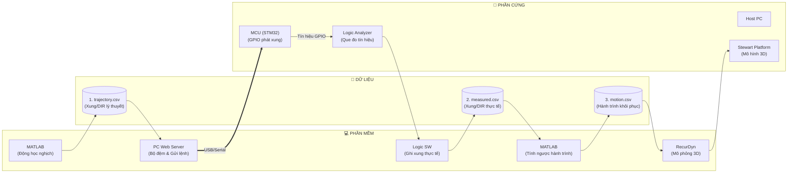

# Sơ Đồ Quy Trình Mô Phỏng Sóng Stewart Platform

Sơ đồ tóm tắt luồng truyền dữ liệu và phối hợp giữa **Phần mềm (Software)**, **Phần cứng (Hardware)** và các **Tệp dữ liệu (CSV)**:

---

### Tóm tắt Luồng Thực Thi

1. **MATLAB (`M1`)** tính động học nghịch $\rightarrow$ xuất `trajectory.csv` (`D1`).
2. **PC Web Server (`S1`)** đọc file $\rightarrow$ truyền gói tin qua **USB Serial** xuống **MCU (`MCU`)**.
3. **MCU (`MCU`)** phát xung GPIO $\rightarrow$ **Logic Analyzer (`LA`)** đo tín hiệu số và xuất file `measured.csv` (`D2`) qua **Logic SW (`LA_SW`)**.
4. **MATLAB (`M2`)** giải mã xung từ `measured.csv` $\rightarrow$ tính ngược hành trình 6 chân $\rightarrow$ xuất `motion.csv` (`D3`).
5. **RecurDyn (`R1`)** đọc `motion.csv` để mô phỏng chuyển động sóng trên mô hình **Stewart Platform (`ST`)**.
