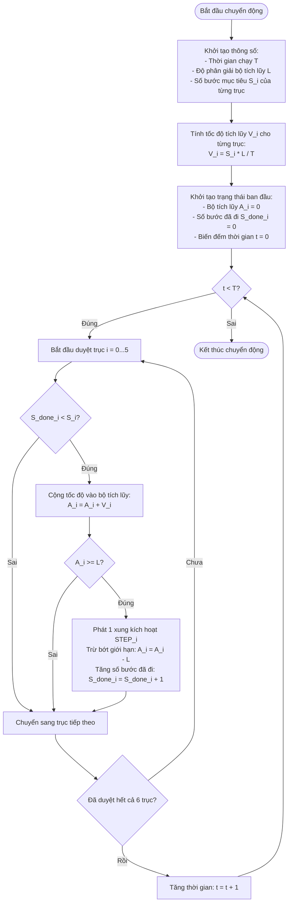

# 📐 Báo Cáo Giải Thuật: Thuật Toán DDA Điều Khiển Đồng Bộ Đa Trục

Báo cáo này giải thích nguyên lý hoạt động của thuật toán **DDA (Digital Differential Analyzer)** ứng dụng trong việc điều khiển đồng bộ nhiều động cơ bước để chúng xuất phát và đến đích cùng một lúc. 

Tài liệu tập trung mô tả bản chất toán học và logic vận hành của giải thuật, không đi sâu vào cấu trúc phần cứng hoặc mã nguồn lập trình, giúp người đọc dễ dàng nắm bắt nguyên lý cốt lõi.

---

## 1. Yêu Cầu Của Hệ Thống & Lý Do Chọn Thuật Toán DDA

Để vận hành một hệ thống robot hoặc máy CNC nhiều trục (ví dụ: robot song song Stewart 6 bậc tự do), hệ thống điều khiển cần đáp ứng những yêu cầu nghiêm ngặt sau:

1. **Đồng bộ hóa thời gian thực tuyệt đối:**
   Tất cả các cơ cấu chấp hành (6 trục động cơ) phải bắt đầu chuyển động đồng thời và hoàn thành quãng đường của mình tại cùng một mili-giây. Nếu một trục về đích trước hoặc sau các trục còn lại, cấu trúc cơ khí sẽ bị xoắn, gây giật cục, sai lệch quỹ đạo hoặc tự khóa cơ học (kẹt cứng robot).
2. **Tần số phát xung cực cao:**
   Hệ thống yêu cầu tần số phát xung lên tới **200 kHz** (tương đương chu kỳ ngắt hoặc chu kỳ phát xung là **5 µs**).
3. **Ràng buộc về tài nguyên tính toán của vi điều khiển:**
   Tại tần số 200 kHz, vi điều khiển chỉ có đúng 5 µs (khoảng 900 chu kỳ lệnh đối với CPU chạy ở 180 MHz) cho mỗi nhịp đếm. Trong khoảng thời gian cực ngắn này, vi điều khiển vừa phải nhận/gửi dữ liệu với máy tính điều khiển (Host), hoán đổi bộ đệm, vừa phải phát xung đồng bộ cho cả 6 trục. Mọi phép toán phức tạp như số thực (float), phép nhân hoặc chia số thập phân trong nhịp đếm sẽ làm CPU bị quá tải ngay lập tức.
4. **Độ chính xác tuyệt đối không sai số tích lũy:**
   Tổng số xung phát ra của mỗi trục trong một khoảng thời gian phải chính xác 100% so với số bước mục tiêu được tính từ Host. Bất kỳ sự sai lệch hay mất xung nào cũng sẽ tích lũy qua các chu kỳ và làm lệch quỹ đạo của robot.

### Vì sao chọn thuật toán DDA?
* **Tối ưu hóa hiệu năng bằng toán số nguyên:** Thay vì tính toán tốc độ động cơ theo thời gian thực bằng các phép chia thập phân phức tạp, thuật toán DDA quy đổi mọi thao tác trong nhịp đếm 5 µs thành **phép cộng tích lũy số nguyên** và **phép so sánh**. Đây là những phép toán cơ bản nhất, chỉ tiêu tốn 1 đến 2 chu kỳ lệnh của CPU.
* **Tự động phân phối xung đều đặn:** Giải thuật phân bố các xung kích hoạt động cơ trải đều trên toàn bộ khoảng thời gian chuyển động, giúp động cơ chạy êm hơn, giảm độ rung giật cơ học.
* **Bảo đảm đồng bộ hóa tự động:** Bằng cách chia tỷ lệ tốc độ của từng động cơ dựa trên một khoảng thời gian chạy chung, thuật toán DDA đảm bảo tất cả các động cơ tự động đồng bộ hành trình và luôn về đích cùng lúc.

---

## 2. Khái Niệm Thuật Toán DDA Đồng Bộ

Trong điều khiển robot hoặc máy công cụ CNC, khi muốn di chuyển cơ cấu từ điểm A sang điểm B trong một khoảng thời gian cố định, các trục động cơ khác nhau sẽ phải đi các quãng đường (số bước) khác nhau. 

**Nguyên tắc đồng bộ:** 
* Trục có quãng đường dài nhất phải tự động quay với tốc độ nhanh nhất.
* Trục có quãng đường ngắn hơn phải tự động quay chậm lại tương ứng.
* Tất cả các trục phải **bắt đầu chuyển động đồng thời và hoàn thành chính xác số bước của mình tại cùng một thời điểm**.

**Giải thuật DDA** giải quyết bài toán này bằng cách sử dụng các **bộ tích lũy số nguyên (accumulator)** để phân phối đều các xung kích hoạt động cơ bước theo thời gian, đảm bảo tần số phát xung của mỗi trục tỉ lệ thuận với quãng đường cần di chuyển của trục đó.

---

## 2. Mô Tả Toán Học và Quy Trình Tích Lũy

### Các tham số đầu vào:
* $S_i$: Số bước mục tiêu cần di chuyển của trục thứ $i$ ($i = 0, 1, ..., 5$).
* $T$: Tổng số đơn vị thời gian (ticks) cố định để hoàn thành chuyển động (ví dụ: $4000$ ticks).
* $L$: Độ phân giải hay giới hạn trên của bộ tích lũy (Scale), thường chọn là một số nguyên lũy thừa của 2 để tối ưu hóa phép toán (ví dụ: $65536$).

### Bước 1: Tính toán tốc độ tích lũy (Velocity) cho mỗi trục
Tốc độ tích lũy $V_i$ của mỗi trục là lượng giá trị sẽ được cộng thêm vào bộ tích lũy sau mỗi đơn vị thời gian (tick). Công thức tính:
$$V_i = \frac{S_i \times L}{T}$$

*Để đảm bảo động cơ đi đủ số bước mục tiêu trong trường hợp phép chia bị lẻ, kết quả của phép tính trên được làm tròn lên (phép chia trần).*

### Bước 2: Vòng lặp tích lũy và phát xung theo thời gian
Với mỗi chu kỳ thời gian (từ tick thứ $1$ đến tick thứ $T$):
1. Mỗi trục $i$ có một bộ tích lũy $A_i$ (ban đầu bằng $0$).
2. Sau mỗi tick, ta cộng thêm tốc độ $V_i$ vào bộ tích lũy:
   $$A_i \leftarrow A_i + V_i$$
3. Kiểm tra điều kiện tràn: Nếu giá trị tích lũy vượt quá giới hạn $L$ ($A_i \ge L$):
   * Phát ra **một xung** điều khiển động cơ bước di chuyển 1 bước.
   * Khấu trừ giới hạn $L$ khỏi bộ tích lũy để chuẩn bị cho chu kỳ tiếp theo: 
     $$A_i \leftarrow A_i - L$$
   * Đánh dấu trục $i$ đã thực hiện được thêm 1 bước.

**Kết quả:** Sau khi chu kỳ thời gian chạy hết $T$ ticks, tổng lượng giá trị cộng vào bộ tích lũy của trục $i$ là $T \times V_i = S_i \times L$. Vì mỗi lần bộ tích lũy vượt quá $L$ ta phát 1 xung, tổng số xung phát ra sẽ đúng bằng $S_i$. Các xung này được phân bố cực kỳ đều đặn trong suốt khoảng thời gian $T$.

---

## 3. Sơ Đồ Giải Thuật (Flowchart)

Sơ đồ dưới đây mô tả chi tiết logic hoạt động của thuật toán DDA đồng bộ đa trục qua từng chu kỳ thời gian:

---

## 4. Tại Sao Giải Thuật Này Tối Ưu?

* **Không sử dụng phép tính số thực (Float):** Trong vòng lặp thời gian thực chạy ở tần số cao, việc tính toán số thực (như nhân/chia số thập phân) cực kỳ tốn tài nguyên. DDA quy đổi mọi phép tính về phép cộng và phép so sánh số nguyên ($A_i \ge L$), giúp bộ xử lý tính toán cực nhanh.
* **Đồng bộ pha tuyệt đối:** Tần số phát xung của các trục được chia tỷ lệ tự động dựa trên thời gian chạy $T$ chung, đảm bảo không có hiện tượng trục này chạy nhanh về đích trước rồi dừng lại chờ trục kia. Tất cả các chuyển động đều bắt đầu và kết thúc một cách mượt mà và đồng điệu.
